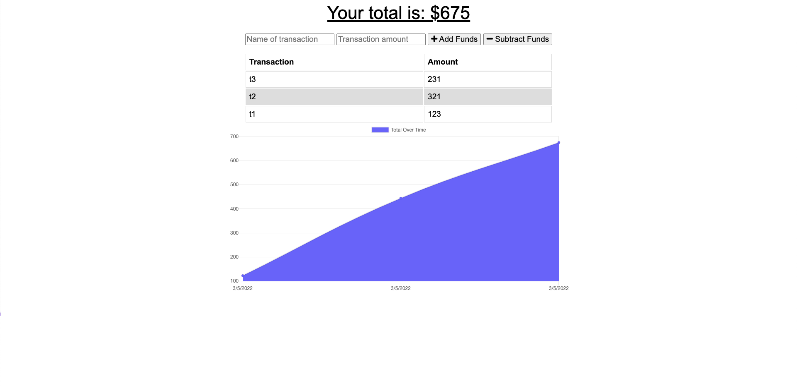

# Budget Tracker

## Description

This is a budget tracker application with offline access and functionality. A User will be able to add expenses and deposits to their budget with or without a connection. If the user enters transactions offline, the total should be updated when they're brought back online

## Live URL

Link to [Heroku](https://damp-coast-73569.herokuapp.com/)

## Usage

In order to use this, you will need Node.js and MongoDB installed

After you've opened up the application, use the command line and go to the root directory and type `npm install` in order to install the dependencies then type `npm start` in order to start up the server

Open up your browser and type `localhost:3001` as the url and it you will be able to use the budget tracker app

The way to use it if using localhost:

1. When online any transaction will be added to mongo and the graph will be updated
2. Can be used offline and transaction data is stored in IDB (_IndexedDB_)
3. When coming online again, data is sent from IDB to mongoDB and IDB is cleared of that data
4. In order to see that new data updated on the page, change the version number of the service worker at the top of `/public/sw.js` file (_this will create a new service worker_), close the tab (_localhost:3001_), and open up the tab again, you may need to refresh the page again and you will see the updated information

The way to use it if using heroku:

1. When online any transaction will be added to mongo and the graph will be updated
2. Can be used offline and transaction data is stored in IDB (_IndexedDB_)
3. When coming online again, data is sent from IDB to mongoDB and IDB is cleared of that data
4. Simply refresh the page while online and the data should be updated

## License

This application is not covered under any license

## Technologies

The technologies used were, Service Workers, Node.js, indexedDB, HTML, CSS, Javascript

## Contributions

By Daniel Arzanipour

## Questions

[My Github](https://github.com/DanielArzani)

If you need to reach me for any additional questions, you can reach me at my [Gmail](mailto:daniel.arzanipour@gmail.com)
